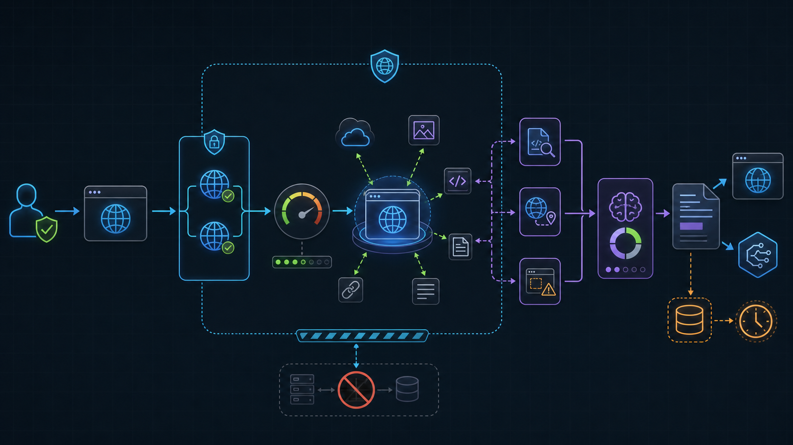
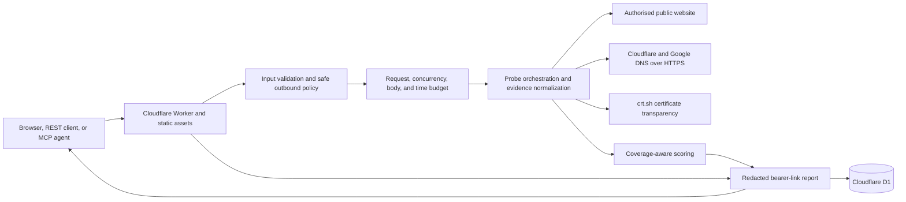

# VulnScope architecture

Last reviewed: 2026-08-23

VulnScope is a bounded external-exposure scanner for authorised public websites. It collects non-destructive HTTP, DNS, header, method, CORS, technology, script, WordPress, sensitive-path, certificate-transparency, and takeover evidence, while making coverage and skipped work explicit.

The infographic is conceptual. The implemented controls and data flows below define the system.

## Product boundary

VulnScope creates a first-pass external evidence report for a public website. It is useful for an owner, developer, MSP analyst, REST client, or AI agent that needs a bounded view of observable web exposure.

It provides:

- public target validation and manual redirect handling
- selected response-header and body evidence
- security-header, cookie, CORS, and supported-method checks
- technology and public client-side dependency signals
- bounded WordPress checks
- optional sensitive-path probes
- optional subdomain-takeover evidence
- certificate-transparency history
- coverage-aware grading, NDJSON progress, shareable reports, REST, OpenAPI, and MCP
- a browser-local record of this browser's scans with previous-scan comparison

It does not provide exploitability, authenticated coverage, CVE proof, port coverage, or a guarantee that a site is secure.

## System context

## Runtime components

| Component | Responsibility | Primary source |
| --- | --- | --- |
| Worker router | Serves assets, validates API and MCP requests, applies rate controls, creates and retrieves reports, exports JSON and Markdown, and runs cleanup | `api/src/index.ts` |
| Safe outbound layer | Enforces schemes, ports, public DNS, host boundaries, redirect checks, request limits, concurrency, time, and body reservations | `api/src/outbound.ts`, `api/src/security.ts` |
| Analyzer | Orchestrates the initial fetch and all enabled phases, normalizes phase status, and builds the report | `api/src/analyzer.ts` |
| DNS engine | Uses independent DNS-over-HTTPS providers and preserves resolver states | `api/src/dns.ts` |
| Header and cookie checks | Evaluates browser-facing security headers and cookie attributes without retaining cookie values | `api/src/headers-audit.ts`, `api/src/cookies.ts` |
| Method and CORS checks | Sends bounded non-destructive requests and interprets each response's policy without combining headers from separate observations | `api/src/methods.ts`, `api/src/cors.ts` |
| Sensitive-path engine | Runs an opt-in bounded catalogue with content-type, multi-marker, and soft-404 controls | `api/src/paths.ts` |
| WordPress checks | Runs bounded public WordPress observations | `api/src/wordpress.ts` |
| Evidence scrubbing | Detects and redacts URL, response, and accidental secret material | `api/src/secrets.ts` |
| Scoring | Converts findings and phase coverage into a grade and severity summary | `api/src/scorer.ts` |
| MCP adapter | Publishes two typed tools over stateless JSON-RPC HTTP | `api/src/mcp.ts` |
| Report UI | Starts scans, renders progress, filters evidence, and renders retrieved reports | `web/app.js`, `web/report-view.js` |
| Local scan history | Keeps a browser-local list of seen reports and diffs a report against an earlier same-host scan; nothing is stored server-side | `web/scan-history.js` |

## Scan flow

1. The caller confirms authorisation and submits a public HTTP or HTTPS URL.
2. The Worker validates route, method, content type, body size, JSON shape, options, and URL before quota charging.
3. The outbound layer rejects credentials, IP literals, non-standard ports, private or reserved DNS answers, resolver uncertainty, and disallowed host changes.
4. The initial request uses manual redirects. Every hop is re-resolved and revalidated. Fixed infrastructure requests also use Worker-supported manual redirect handling and reject any redirect response.
5. The analyzer captures bounded body and header evidence from the public web response.
6. Core phases evaluate headers, cookies, methods, CORS, technology, public scripts, WordPress signals, and certificate-transparency history.
7. Sensitive-path and takeover phases run only when explicitly enabled. They use the same safe outbound layer and remaining request budget.
8. Each phase records measured, partial, failed, unavailable, or skipped state plus attempted, successful, failed, byte, and truncation evidence.
9. The scorer prevents a clean grade when requested coverage failed or remained partial.
10. URL credentials, query values, fragments, cookie values, signed URLs, and URL-bearing evidence are removed before persistence.
11. The report is written to D1 under an opaque identifier and returned through JSON, NDJSON, the report UI, or MCP.

## Probe budget

A scan is constrained to:

- 46 outbound requests
- six concurrent outbound connections
- 25 seconds for outbound work, with each request timeout capped at the remaining duration
- 2 MiB aggregate response-body inspection
- 256 KiB for the primary page body
- bounded per-phase bodies and redirect depth
- a configured maximum of 18 sensitive-path probes, sampled across severity tiers with a per-scan rotation so the whole catalogue stays reachable over consecutive scans

When a budget is exhausted, the remaining work is marked partial or skipped. The report does not assume unexecuted checks passed.

## Interfaces

| Interface | Capability |
| --- | --- |
| `POST /api/v2/scan` | Complete synchronous scan |
| `POST /api/scans/stream` | NDJSON progress and final report |
| `GET /api/scans/{reportId}` | Retrieve an unexpired report |
| `GET /api/scans/{reportId}/export` | Download the report as JSON or Markdown (`?format=markdown`) |
| `POST /mcp` and `POST /mcp/v2` | Stateless MCP over JSON-RPC HTTP |
| `/openapi.yaml` | REST and result schemas |
| `/mcp-copilot.yaml` | Copilot Studio MCP connector metadata |

MCP publishes `scan_website` and `get_vulnscope_report`.

Known resources answer unsupported methods with 405 and an `Allow` header naming the supported set, so a wrong method is distinguishable from a missing path.

## Third-party services and data disclosure

| Service | Use | Data sent | Required |
| --- | --- | --- | --- |
| Cloudflare Workers and Assets | Runtime, routing, static site, observability, and Cron | Normal service request metadata | Yes |
| Cloudflare D1 | Scan reports, expiry metadata, and durable quota state | Redacted report JSON, opaque IDs, timestamps, and daily scope-specific HMAC client fingerprints | Yes for report sharing |
| Cloudflare DNS over HTTPS | Public-target validation and DNS evidence | Hostname and record type | Yes |
| Google Public DNS | Fallback public-target validation when the primary resolver transport fails | Hostname and record type | Yes |
| `crt.sh` | Best-effort certificate-transparency names and history | Target hostname or constrained subdomain query | Conditional |
| Authorised target website | HTTP, redirect, header, body, method, CORS, script, WordPress, path, and takeover-signature observations | Normal bounded HTTP requests with a VulnScope user agent | Core subject |
| `tldts` | Local registrable-domain and public-suffix handling | No external service call | Local dependency |

VulnScope has no CVE feed, malware reputation service, browser-rendering service, port scanner, exploit engine, or credential integration.
Detected CMS versions remain fingerprint evidence. VulnScope does not grade a WordPress version as vulnerable without a maintained advisory source.

## Storage and retention

- Redacted reports are stored in D1 under opaque bearer identifiers.
- Reports expire after 14 days by default.
- A daily Cron Trigger deletes expired reports and old quota rows.
- Report and export responses use private, no-store caching.
- Valid report reads, recent-scan cache hits, and MCP negotiation, discovery, and notifications do not write durable quota state.
- Web scans and MCP `scan_website` calls charge separate per-IP daily buckets (`DAILY_SCAN_LIMIT` scope `scan`, `MCP_DAILY_LIMIT` scope `mcp`) through the same atomic counter, so one caller class cannot exhaust the other's allowance.
- D1 stores a versioned HMAC of the quota scope, UTC date, and source IP. `RATE_LIMIT_HMAC_KEY` is a managed Worker secret with at least 32 bytes and is not stored in repository configuration. Rotating it resets the current day's counters.
- Anyone holding an unexpired report identifier can retrieve the report.
- The browser keeps a local-only list of seen reports (ID, hostname, grade, counts, timestamps) in `localStorage`, capped at 24 entries and pruned on expiry; it never sends that list to the server and is cleared by the viewer at will.

## Security boundaries

- Every outbound request, including scripts, paths, WordPress, CORS, redirects, and takeover checks, uses one fail-closed policy.
- Public DNS is checked before network access and every redirect hop.
- Cloudflare DNS-over-HTTPS is primary. A transport failure retries the same record through Google Public DNS. A valid empty answer is preserved and does not trigger fallback.
- Same-host access is the default. Limited same-registrable-domain access remains subject to public DNS checks.
- A non-success main GET is recorded as failed coverage. VulnScope does not audit or grade the headers of that error response.
- The production Worker rejects scans of its own hostname because a same-zone Worker fetch cannot provide an independent public observation.
- Forms are not submitted, credentials are not accepted, and destructive HTTP methods are not used.
- Response bodies, request bodies, concurrency, elapsed time, and redirect depth are bounded.
- Stored cookie values, URL secrets, query values, and fragments are removed.
- Optional probes require explicit caller selection and appear in coverage.
- The service remains open for limited testing and relies on bounded abuse controls rather than user ownership.

See `THREAT_MODEL.md` for threats, controls, residual risk, and operational gates.

## Deployment topology

Production uses one Cloudflare Worker and asset binding on `scan.illek.ie`. The Worker runs first for static and API paths, D1 is bound as `DB`, observability is enabled, and cleanup runs daily at `23 4 * * *` UTC. `workers.dev`, preview URLs, and Pages deployments are disabled.

## Failure model

Resolver disagreement fails closed. An individual optional phase failure is preserved in the coverage model. Target-controlled content remains untrusted throughout parsing and rendering. D1 persistence failure prevents creation of a durable report identifier.

## Non-goals

VulnScope does not exploit targets, submit forms, authenticate, crawl arbitrary links, scan ports, collect credentials, run a browser, verify active TLS certificates, prove takeover ownership, or claim complete vulnerability coverage.

## Verification map

- Type safety, unit and contract suite, browser JavaScript syntax, dependency audit, and Worker dry run: `cd api && npm run verify:release`
- Read-only production shell, API, redirect, and MCP smoke: `cd api && npm run smoke:production`
- Mutating end-to-end scan and report smoke, with release-owner approval: `cd api && npm run smoke:production:scan`
- Threat model: `THREAT_MODEL.md`
- REST schema: `web/openapi.yaml`
- MCP connector schema: `web/mcp-copilot.yaml`
