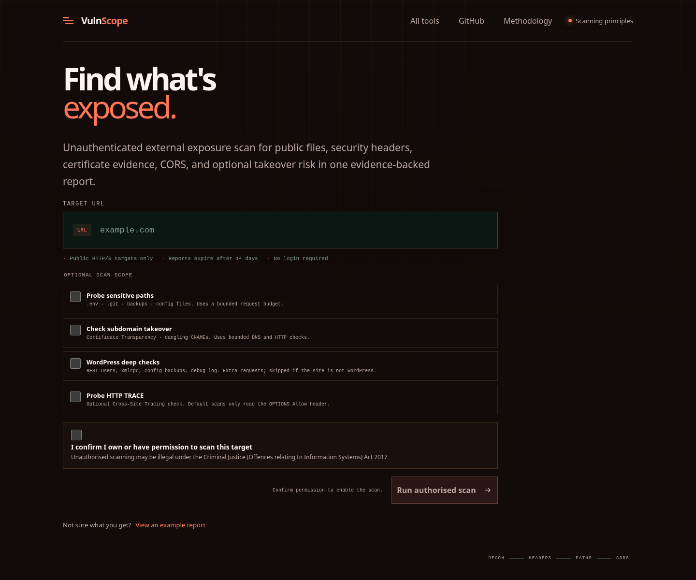
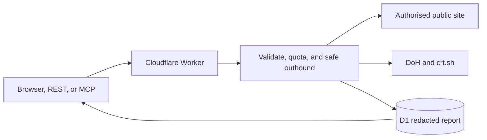

# VulnScope

Inspect a public website's external exposure. Review security headers, public
files, certificate evidence and optional checks in a report that explains what ran.

[Open VulnScope](https://vulnscope.illek.ie) · [More Illek tools](https://tools.illek.ie)



*Live interface captured on 12 September 2026.*

## Try it

Choose **View an example report** to explore the output. To inspect your own
website, enter its public URL, select the checks you need, confirm permission,
and choose **Run authorised scan**.

Checks are bounded and unauthenticated. VulnScope does not exploit vulnerabilities,
submit forms or bypass authentication. Skipped checks are not treated as passes.

[scan.illek.ie](https://scan.illek.ie) redirects to the same service.

## How a scan runs



The Worker applies one outbound policy to the initial URL, redirects,
scripts, WordPress checks, CORS probes, methods, and takeover evidence. A
scan allows at most **46 outbound requests** (32 on MCP), **six concurrent**
outbound connections (four on MCP), a **25-second** outbound-work deadline
(15 seconds on MCP), and bounded response bodies. Exhausted work is marked
partial or skipped — the report does not treat unexecuted checks as passed.

## What it checks

**Always on:** public-target validation, security headers, cookies (names and
flags only), supported methods, CORS, technology and public script signals,
and certificate-transparency history.

**Opt-in** (and reported as partial when the budget runs out): sensitive-path
probes, subdomain-takeover evidence, WordPress deep checks, and TRACE.

**Not in scope:** exploitability, authenticated coverage, CVE proof, port
scans, form submission, credential collection, browser rendering, active TLS
protocol or cipher tests, proof of takeover ownership, or a guarantee that a
site is secure.

In the browser, VulnScope keeps a local-only list of reports this browser
has seen (ID, hostname, grade, timestamps) and can diff a report against an
earlier same-host scan. That list lives in `localStorage`. The server stores
no history relationship between reports.

## Quickstart

### Live API

```sh
# Create a scan (201 with the full report; charges the daily web quota)
curl -sS -X POST https://vulnscope.illek.ie/api/v2/scan \
  -H 'Content-Type: application/json' \
  -d '{"url": "example.com", "probePaths": false, "checkTakeover": false, "checkWordPress": false, "probeTrace": false}'

# The same scan with newline-delimited progress events
curl -sS -X POST https://vulnscope.illek.ie/api/scans/stream \
  -H 'Content-Type: application/json' \
  -d '{"url": "example.com"}'

# Read or export an unexpired report by its 16-character ID
curl -sS https://vulnscope.illek.ie/api/scans/<reportId>
curl -sSOJ https://vulnscope.illek.ie/api/scans/<reportId>/export
# The same export as a Markdown document for tickets and review docs
curl -sSOJ "https://vulnscope.illek.ie/api/scans/<reportId>/export?format=markdown"
# Poll without re-downloading: revalidate the ETag from the previous 200
curl -sS -o /dev/null -w '%{http_code}\n' \
  -H 'If-None-Match: "<etag-from-previous-response>"' \
  https://vulnscope.illek.ie/api/scans/<reportId>
```

### Local development

From `api/`, copy `api/.dev.vars.example` to `api/.dev.vars`, then run
`npx wrangler dev --local` and open `http://localhost:8788`. The session
runs in the development environment via `api/.dev.vars`, which disables the
production HTTP→HTTPS entry redirect that would otherwise loop forever under
`wrangler dev`'s custom-domain emulation and allowlists the emulated origin
so the page can call the API same-origin. The example file also supplies a
dummy `RATE_LIMIT_HMAC_KEY` of at least 32 bytes. Keep the real
`api/.dev.vars` file gitignored. Production values in `wrangler.toml` are
unaffected.

### Release checks

From `api/`, run `npm run verify:release`. It covers TypeScript, unit and
contract tests, browser JavaScript syntax, the dependency audit, and a
Cloudflare deployment dry run. Repository CI runs the same command for every
push and pull request.

After deployment, run `npm run smoke:production`. It checks the public
shell, security headers, health and API metadata, HTTP-to-HTTPS redirect,
and MCP initialisation and CORS without creating a scan or writing a
report. The separate `npm run smoke:production:scan` command creates a real
target scan and stores a production report. Run that mutating check only
with release-owner approval.

## API and MCP

```text
GET  https://vulnscope.illek.ie/api/v2
POST https://vulnscope.illek.ie/api/v2/scan
POST https://vulnscope.illek.ie/mcp
POST https://vulnscope.illek.ie/mcp/v2
```

The MCP endpoints implement stateless JSON-RPC over HTTP, negotiate
`2025-11-25` (echoing a client-pinned `2025-06-18` when requested), and
publish `scan_website` plus `get_vulnscope_report`. REST scan progress uses
newline-delimited JSON (`application/x-ndjson`). Copilot Studio can import
`https://vulnscope.illek.ie/mcp-copilot.yaml`; OpenAPI agents can import
`https://vulnscope.illek.ie/openapi.yaml`.

MCP remains publicly usable for testing (no API key).

```sh
# MCP: initialize, then call a tool (stateless; no session handshake needed)
curl -sS -X POST https://vulnscope.illek.ie/mcp/v2 \
  -H 'Content-Type: application/json' \
  -d '{"jsonrpc":"2.0","id":1,"method":"initialize","params":{"protocolVersion":"2025-11-25"}}'
curl -sS -X POST https://vulnscope.illek.ie/mcp/v2 \
  -H 'Content-Type: application/json' \
  -d '{"jsonrpc":"2.0","id":2,"method":"tools/call","params":{"name":"scan_website","arguments":{"url":"example.com"}}}'
```

## Security, privacy, and quotas

Read [THREAT_MODEL.md](./THREAT_MODEL.md) before operating a deployment.

Reports are **opaque bearer links**: anyone with the report ID can read an
unexpired report, so share links only with approved reviewers. Reports
expire after the configured retention period (14 days by default), are
served with private no-store caching, and remove cookie values plus query
and fragment components from stored URL evidence. Secret findings store a
SHA-256 fingerprint of the match, never prefix, suffix, or connection-string
userinfo.

Daily quota identifiers use a scope-specific HMAC and never store the source
IP address. Before the first production deployment, generate a random secret
of at least 32 bytes and store it with
`cd api && npx wrangler secret put RATE_LIMIT_HMAC_KEY`. Do not put the
production value in `wrangler.toml` or `.dev.vars`. A missing or short HMAC
key fails closed with an operator-visible error. Validation failures and
recent-scan cache hits are uncharged, recent-scan cache keys are scoped to
the caller's daily quota identity, and a scan aborted by a VulnScope
resolver outage is refunded so the invited retry is free.

| Limit | Web / REST | MCP |
| --- | --- | --- |
| Outbound requests per scan | 46 | 32 |
| Concurrent outbound connections | 6 | 4 |
| Outbound-work deadline | 25 s | 15 s |
| Daily scans | 50 | 10 (clamped at 20) |
| Daily well-formed report reads | 80, shared with MCP; ETag revalidation uncharged | 80, shared with web |

The MCP daily scan quota is well below the web-form quota so agents cannot
exhaust a shared caller's browser allowance. The service stays open for
limited testing and relies on these bounds rather than caller authentication.

## Deeper docs

- [ARCHITECTURE.md](ARCHITECTURE.md) — components, data flow, probe budget, storage, and third-party services
- [THREAT_MODEL.md](THREAT_MODEL.md) — threats, controls, residual risk, and operational gates
- Live OpenAPI: [vulnscope.illek.ie/openapi.yaml](https://vulnscope.illek.ie/openapi.yaml)
- Live MCP connector: [vulnscope.illek.ie/mcp-copilot.yaml](https://vulnscope.illek.ie/mcp-copilot.yaml)

## Feedback and contributions

Found a problem? [Report a bug](https://github.com/koya-illek/vulnscope/issues/new?template=bug_report.md).
See [CONTRIBUTING.md](CONTRIBUTING.md) for fixes and feature proposals, or
[SECURITY.md](SECURITY.md) to report a vulnerability.

## License

MIT © Koya Illek. See [LICENSE](LICENSE).

Live service: [vulnscope.illek.ie](https://vulnscope.illek.ie).